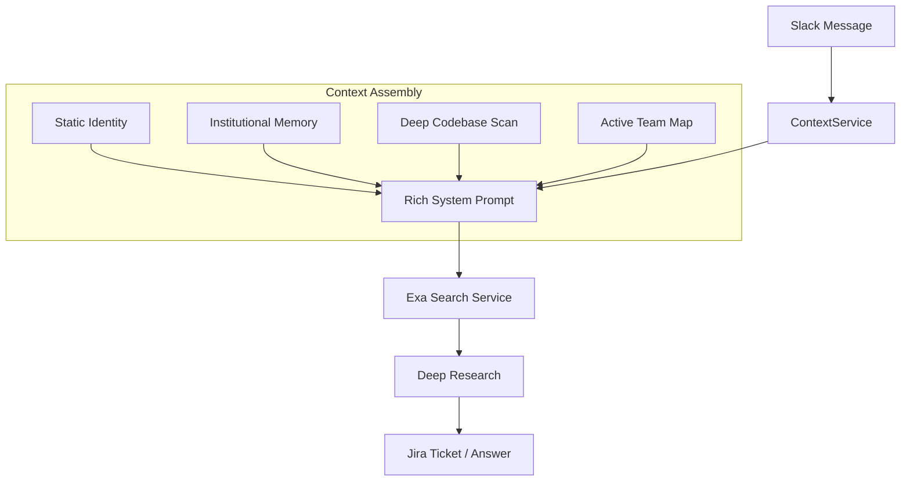

# 🧠 Traverse.ai Context Engine

The **Context Engine** is the "Brain" of the Slack Intelligence platform. It transforms generic AI responses into highly specific, context-aware engineering solutions.

## 🚀 Key Capabilities

### 1. Self-Awareness (Deep Scan)
The engine dynamically scans its own source code (`backend/`) at runtime.
*   **What it does:** Maps file structures, classes, and method signatures.
*   **Why it matters:** The AI knows that `SlackIngester` has a `sync_channels` method. It understands the exact "API Surface" of the application without hardcoding.

### 2. Institutional Memory
A persistent knowledge base of past engineering challenges and solutions.
*   **Example:** "How do we handle Slack 429 errors?" -> "Use `tenacity` for exponential backoff."
*   **Implementation:** `backend/context/institutional_memory.json`

### 3. Team Awareness
Automatically maps active Slack users to their roles based on interaction history.
*   **Why it matters:** The AI knows "Kyle" is the Engineering Lead and "Bot" is the automation account.

## 🛠️ How It Works



## 🧩 Components

| File | Purpose |
|------|---------|
| `backend/services/context_service.py` | Aggregates all context, performs AST code scanning |
| `backend/integrations/exa_service.py` | Consumes context for smart search queries |
| `backend/context/identity.md` | Company identity, mission, tech stack |
| `backend/context/institutional_memory.json` | Past solved problems (15+ entries) |
| `backend/context/plans/` | Product PRDs loaded into context |

## 🧪 Verification

Run the test script to see the engine in action:
```bash
python scripts/test_context_awareness.py
```

**Success Criteria:**
*   ✅ Identity Loaded
*   ✅ Codebase Scanned (finding specific files)
*   ✅ Query Inference (AI mentions "FastAPI" or "Slack SDK" without being told)

